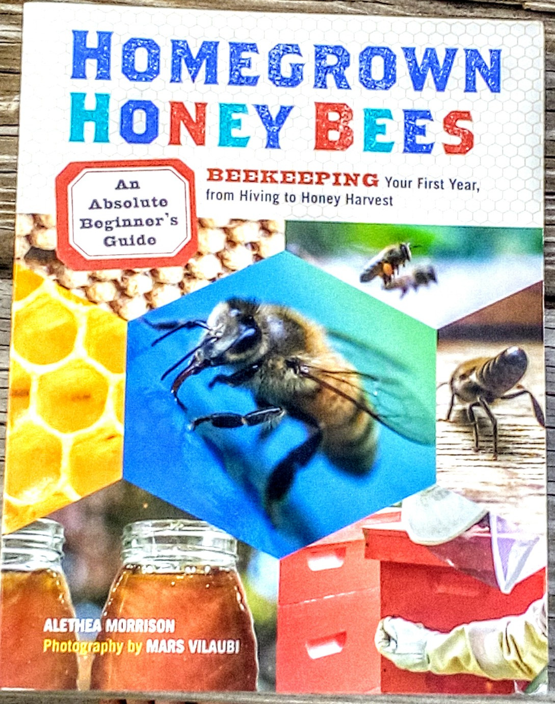
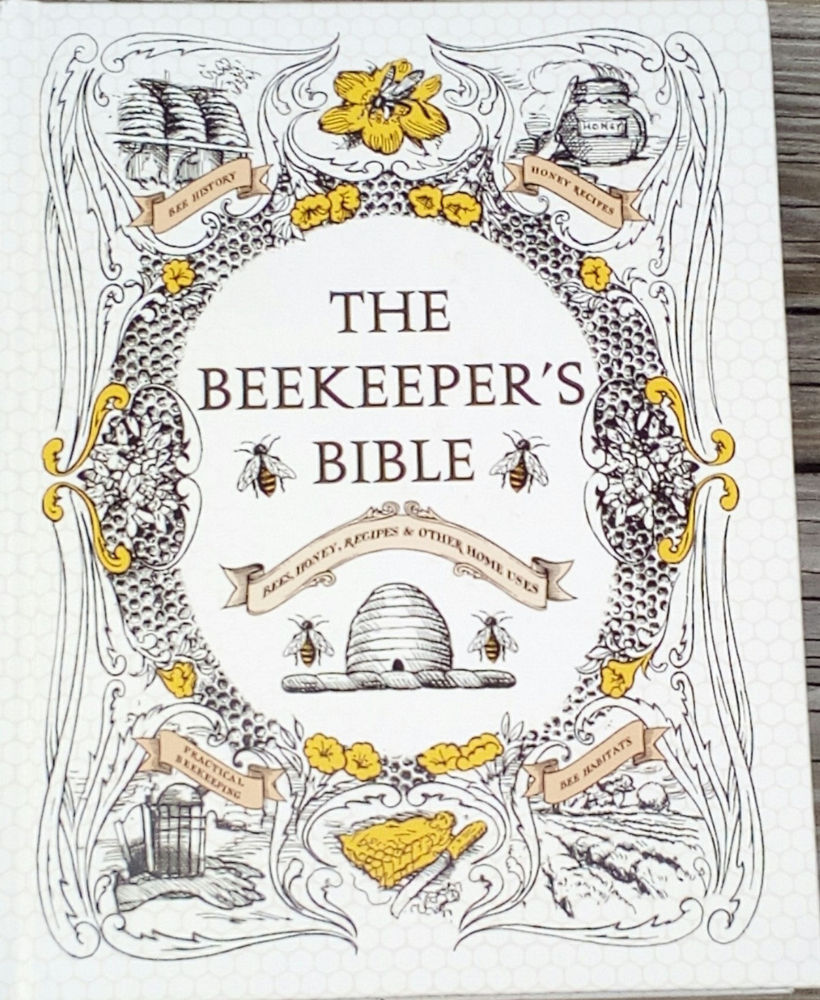

+++
author = "Lucas Z. Sons"
categories = ["Beekeeping"]
date = 2017-09-17T22:21:38Z
description = ""
draft = false
image = "/images/2017/09/IMG_20170917_180628.jpg"
slug = "a-reading-list-for-new-beekeepers"
tags = ["Beekeeping"]
title = "A Reading List for New Beekeepers"

+++

If you are considering becoming a beekeeper, the first thing you should do is start reading and learning so you know a bit about what you'll be doing. [*Homegrown Honeybees* by Alethea Morrison](http://amzn.to/2wzNxav) is the best place to start.  It's simple, easy to read, and covers all the basics.  Read it more than once.  After that, here are some others to check out:

- [*First Lesson In Beekeeping*](http://amzn.to/2xJ9dGd) was my second book about bees, after Homegrown Honeybees.  It is highly recommended. 
- [*The Beekeeper's Bible*](http://amzn.to/2xJjIcL) is a new part of my library. It has a bit about bees, a bit about the history of beekeeping, a bit about things to do with honey and beeswax, and I'm not sure what else.  It's *big*, and also interesting and varied.

- [*The Practical Beekeeper: Beekeeping Naturally* by Michael Bush](http://amzn.to/2y7VogD) Is full of very good information, but it is a collection of material that Mr. Bush wrote on his web site and elsewhere, so it's not organized the way you might expect a book to be.
- [*The Hive And The Honeybee*](https://www.dadant.com/catalog/publications/m00010-hive-and-the-honeybee-new-edition) (the Dadent edition, not the historical ones) is a good reference to keep on your shelf, but don't try to read it beginning to end.

Also, reading is not the only way to learn about beekeeping.  I learned many things from [Don the Fat Bee Man's Youtube series](https://www.youtube.com/user/fineshooter/videos).

