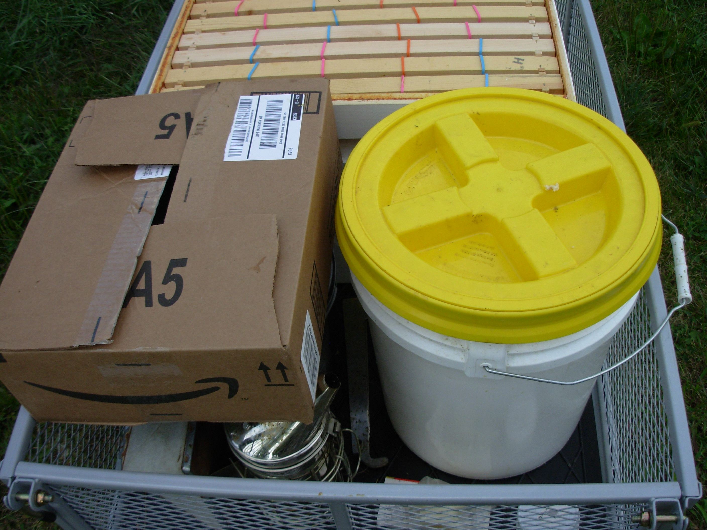

+++
author = "Lucas Z. Sons"
categories = ["Beekeeping", "Equipment"]
date = 2017-09-02T23:35:32Z
description = ""
draft = false
image = "/images/2017/09/DSCN0048.jpg"
slug = "tools-of-the-trade"
tags = ["Beekeeping", "Equipment"]
title = "Tools of the Trade"

+++

Having your tools for beekeeping around is important, as well as having them. Which is why I came up with a solution to transport the tools I'll need from my barn, to my hives.

I have a large, sturdy, and pneumatic cart that allows me to move my most important tools for beekeeping when I need them. It has removable sides that're useful when I need to transport something big and heavy. It has pneumatic tires that make it easier to go over rough things like rocks and stuff. And even better, a detachable handle that reveals a hitch that I can attach to my mom's lawnmower!

In my cart, I have four boxes of frames. Two in case I need to add another box to both of my hives, and two that have frames with rubber bands on them if I needed to cut out some honeycomb I want to save. When I use the two extra boxes of frames to the hives, I can get out two more boxes to replace the two that I just used in my cart.

What's the point in having beekeeper tools when you don't even have a hive tool or two? These tools are helpful in prying boxes open and helping you take out frames. I have two hive tools total, just in case I need an extra one. Hive tools are the most useful of beekeeper tools. So, when you're thinking about beekeeping, be sure to have at least one hive tool with you.

The smoker is another most useful beekeeper tool. It helps me clear the bees out of the spot in the hive where I want to work. So, make sure you have one close to you as well. I also have I specifically have hardwood smoker pellets, which are basically smoker fuel that keeps the smoker lit longer. I like to keep the fuel in a bucket so that I don't spill it as often.

Speaking of smokers and smoker fuel, since I have some easy-lit smoker fuel. I don't need to pick up some dead grass that might be already wet and have a fuss about lighting it. So, I just use some scrap paper instead so I have something to light the smoker fuel. I like to keep a stash in a cardboard box in my cart so I don't have to run into the house all the time. With my tools I already have listed, I have a bee friendly, 5 gallon bucket. I use it to save the bee feeder water that I pore in when I remove the feeder, so I don't have to refill it from scratch, which is another use for it (but I only do that if the feeder(s) are empty).

Well, these are my tools I have and what they're helpful for. I hope this informational enough for you to have an easier time with you and your tools if you ever want to start beekeeping.

